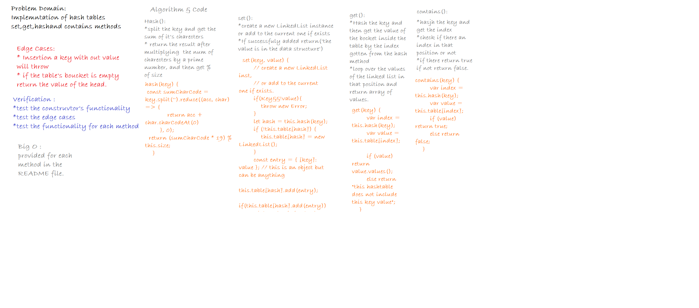

# Hash Tables
This code  challenge is about instenciate a new hash table data structure and test three functions `set()` `includes()` `hash()` `get()`.

## Challenge
Implement a Hashtable with the following methods:

* set: takes in both the key and value. This method should hash the key, and add the key and value pair to the table, handling collisions as needed.
* get: takes in the key and returns the value from the table.
* contains: takes in the key and returns a boolean, indicating if the key exists in the table already.
* hash: takes in an arbitrary key and returns an index in the collection.

## Approach & Efficiency
**set**
 * Time:O(1)
 * Space:O(1)
 
**get**

 * Time:O(1)
 * Space:O(n)
 
**contains**
 * Time:O(1)
 * Space:O(1)
 
 **hash**
* Time:O(1)
* Space:O(1)

*Test:* 
you can run (npm test hashtable.test.js)

## API

