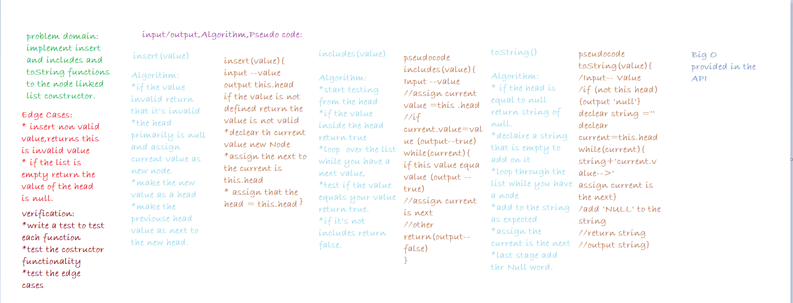

# Singly Linked List
This code  challenge is about instenciate a new linked list data structure and test three functions `insert()` `includes()` `toString()` `append()` `insertBefore()` `insertAfter()`.

## Challenge
* Create a Node class that has properties for the value stored in the Node, and a pointer to the next Node.
* Within your LinkedList class, include a head property. Upon instantiation, an empty Linked List should be created.
* Define a method called `insert` which takes any value as an argument and adds a new node with that value to the head of the list with an O(1) Time performance.
* Define a method called `includes` which takes any value as an argument and returns a boolean result depending on whether that value exists as a Node’s value somewhere within the list.
* Define a method called `toString`which takes in no arguments and returns a string representing all the values in the Linked List, formatted as:
"{ a } -> { b } -> { c } -> NULL"
* Add a method called `append(value)` which adds a new node with the given value to the end of the list.
* Add a method `insertBefore(value, newVal)` which add a new node with the given newValue immediately before the first value node.
* Add a method `insertAfter(value, newVal)` which add a new node with the given newValue immediately after the first value node.

## Approach & Efficiency
**insert**
 * Time:O(1)
 * Space:O(1)
**inclides**
 * Time:O(n)
 * Space:O(1)
**toString**
 * Time:O(n)
 *Space:O(1)
**append**
* Time:O(n)
*Space:O(1)
**insertBefore**
* Time:O(n)
*Space:O(1)
**insertAfter**
* Time:O(n)
*Space:O(1)

*Test:* 
you can run (npm test linked-list.test.js)

## API
