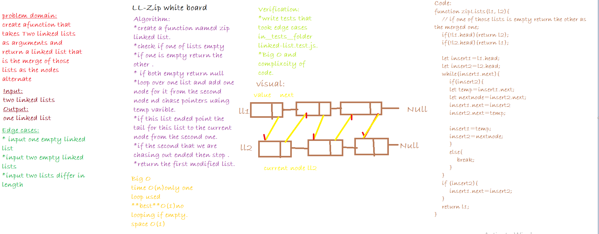

# Singly Linked List
This code  challenge is about create a function takes two linked lists returns one that merge between them as nodes alternate with each other .

## Challenge
* Write a function called zipLists which takes two linked lists as arguments. Zip the two linked lists together into one so that the nodes alternate between the two lists and return a reference to the head of the zipped list. Try and keep additional space down to O(1). You have access to the Node class and all the properties on the Linked List class as well as the methods created in previous challenges.

## Approach & Efficiency:
tests are provided in the `__tests__` folder in `linked-list.test.js`,`ll-Zip Modules`.

## API
