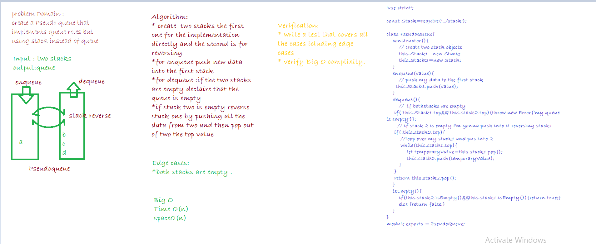

# Stack With Queue

this code challenge is about creating pseudo queue that taks the standard of a queue but using a stack to implement it.  

## Challenge
* Create a brand new PseudoQueue class. Do not use an existing Queue. Instead, this PseudoQueue class will implement our standard queue interface (the two methods listed below), but will internally only utilize 2 Stack objects. 

## Approach & Efficiency:
tests are provided in the `__tests__` folder in `stackAndQueues.test.js`,`Stack with queue describtions`.

## API
