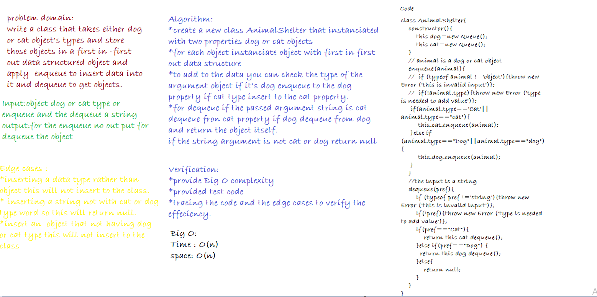

# Fifo Animal Shelter:
this code challenge is about creating anew class that stores data with first in first out data structure and isert only objects with specific type either animal or dog object and do the enqueue and dequeue , this code is done with JavaScript language.

## Challenge
* Create a class called AnimalShelter which holds only dogs and cats. The shelter operates using a first-in, first-out approach.
Implement the following methods:
enqueue(animal): adds animal to the shelter. animal can be either a dog or a cat object.
dequeue(pref): returns either a dog or a cat. If pref is not "dog" or "cat" then return null.

## Approach & Efficiency:
tests are provided in the `__tests__` folder in `animal-shelter.test.js`.

## API
