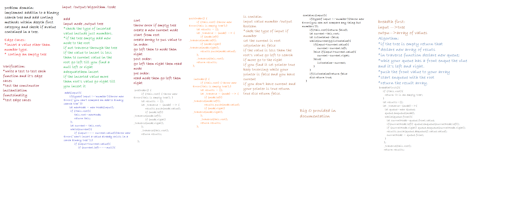

# Trees
this folder contains an implementation to a data structure which is trees and how to insert in it to instanciate a binary search tree type and some methods to sort data inside the tree with deepth first category *preOrser() postOrder() inOrder()*

## Challenge
* Create a Node class that has properties for the value stored in the node, the left child node, and the right child node.

* Create a BinaryTree class

* Define a method for each of the depth first traversals called `preOrder`, `inOrder`, and `postOrder` which returns an array of the values, ordered appropriately.

* Create a BinarySearchTree class
 * Define a method named add that accepts a value, and adds a new node with that value in the correct location in the binary search tree.
 * Define a method named contains that accepts a value, and returns a boolean indicating whether or not the value is in the tree at least once.

## Approach & Efficiency
**add**
 * Time:O(n)
 * Space:O(h)
**inOrder**
 * Time:O(n)
 * Space:O(h)
**preOrder**
 * Time:O(n)
 *Space:O(h)
**postOrder**
* Time:O(n)
*Space:O(h)
**contains**
* Time:O(n)
*Space:O(h)
**find Maximum**
* Time with binary tree O(n),with binary search tree O(log(n))
* Space O(1) 
**breadth first**
Time O(n)
space O(n)

## API

