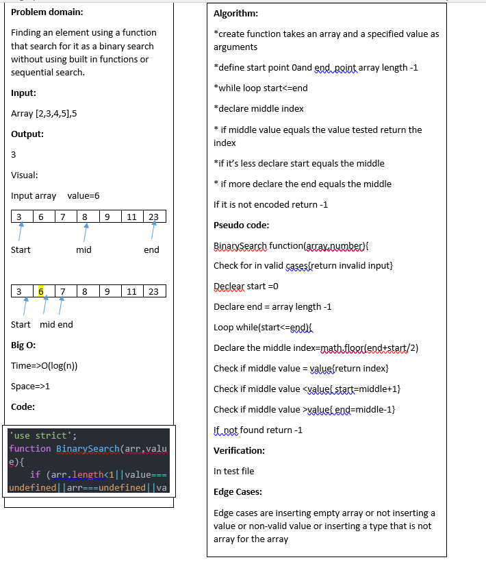

# Array Binary
This code  challenge is about creating a binarry test algorithm , and this code written using JavaScript.

## Challenge

Write a function called BinarySearch which takes in 2 parameters: a sorted array and the search key. Without utilizing any of the built-in methods available to your language, return the index of the array’s element that is equal to the search key, or -1 if the element does not exist.
## Approach & Efficiency

To solve this problem I looped over a sorted array while the starting point for my search was the middle index of the array and my starting point value is less than the ending point ,and compared the value in an enterval changed based on the change of lower and higher limits of the search and if the array includes the tested vakue i return the index else if it does not I returned -1;

*Test:* 
you can run (npm test binarySearch.test.js)

## Solution
