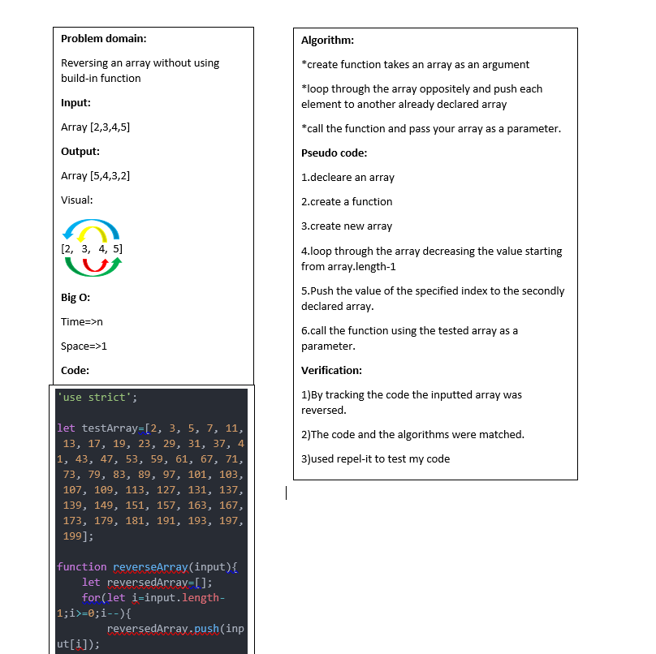

# Array Reversing
This code  challenge is about reversing an array without the need of using a built-in method which is array,reverse() in  the JS language.and this code written using JavaScript.

## Challenge

Write a function called reverseArray which takes an array as an argument. Without utilizing any of the built-in methods available to your language, return an array with elements in reversed order.

## Approach & Efficiency

to solve this problem I created new varaible array and looped over this array in deecreasing order starting from the hieghest index of this array, and pushed each value to another decleared array (reversedArray),then returned the reversed array and call the function using the tested array as a parameter.

*Test:* [test link](https://repl.it/@Aishahsatouf/arrayreverse#index.js)

## Solution
