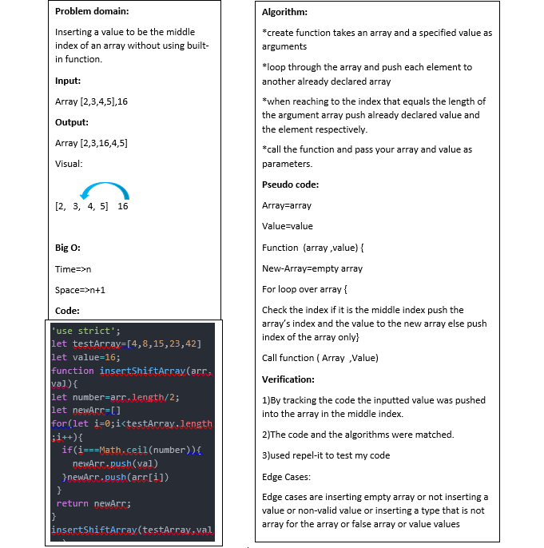

# Array Shifting
This code  challenge is about inserting a value into the middle index of an array without the need of using a built-in method, and this code written using JavaScript.

## Challenge

Write a function called `insertShiftArray `  which takes in an array and the value to be added. Without utilizing any of the built-in methods available to your language, return an array with the new value added at the middle index.
## Approach & Efficiency

to solve this problem I created new varaible array and a new value then created a new array then looped over my array ,for each index I keeped push the value of my array's index to the new array and test if the index equals the miidle index of my array and in that point only pushed the new value ,the value of that index respectively and returned my new array. 

*Test:* [test link](https://repl.it/@Aishahsatouf/EmotionalLargeAddon#index.js)

## Solution
