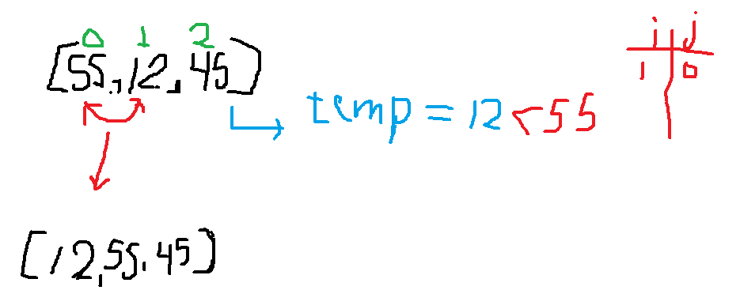
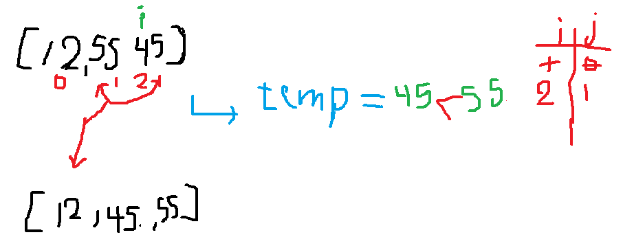
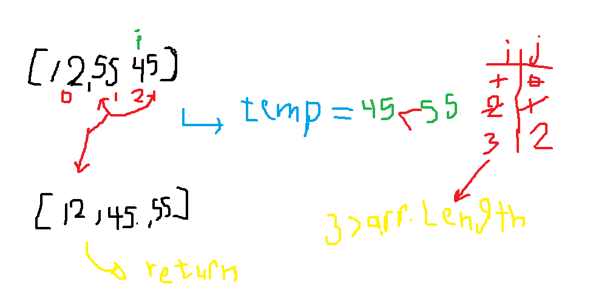

# Selection Sort
Selection Sort is a sorting algorithm that traverses the array multiple times as it slowly builds out the sorting sequence. The traversal keeps track of the minimum value and places it in the front of the array which should be incrementally sorted.

## Pseudocode

## Trace
 sample array `[55,12,45]`

**Pass 1**:

`[55,12,45]`

During the first pass, index position 1 is assigned to the temp variable (12). Since j is equal to 0 and the temp (12) is < array[0] wwhich is (55) the while loop is entered. The array position 1 is then assigned the value of the current array position 0 (55). j is then decremented. After exiting the while loop the array position 0 is assigned the temp value (55).

At the end of the first pass the array is [12,55,45].
**Pass 2**:

`[12,55,45]`

During the second pass, index position 2 is assigned to the temp variable (45). Since j is equal to 1 and the temp (45) is < array[1] (55) the while loop is entered. The array position 2 is then assigned the value of the current array position 1 (55). j is then decremented. After exiting the while loop the array position 1 is assigned the temp value (45).

At the end of the second pass the array is [12,45,55].

**Pass 3**:

`[12,45,55]`

On the third pass, i = 3 which is not less than the array.length. So, the for loop is not entered and the algorithm proceeds to return array.

The sorted array is returned: [12,45,55].

## Efficency

* Time: O(n^2)
  * The basic operation of this algorithm is comparison. This will happen n * (n-1) number of times…concluding the algorithm to be n squared.
* Space: O(1)
  * No additional space is being created. This array is being sorted in place…keeping the space at constant O(1).