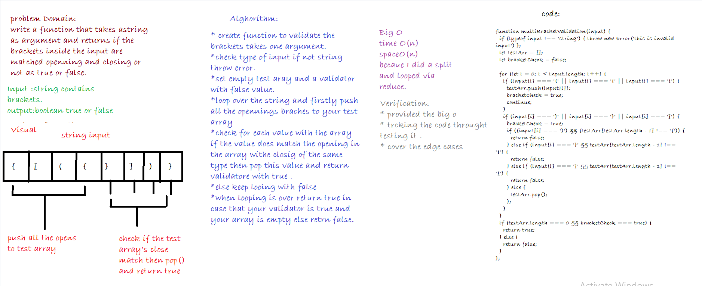

# Multi Brackets Validation

This code  challenge is about createing a function that returns a boolean true or false that is checking on the input if it has all the brackets matched opened and closed or not.

## Challenge
* Your function should take a string as its only argument, and      should return a boolean representing whether or not the brackets in the string are balanced. There are 3 types of brackets:

 * Round Brackets : `()`
 * Square Brackets : `[]`
 * Curly Brackets : `{}`
## Approach & Efficiency:
tests are provided in the `__tests__` folder in `multi-bracket-validation.test.js`.

## API
