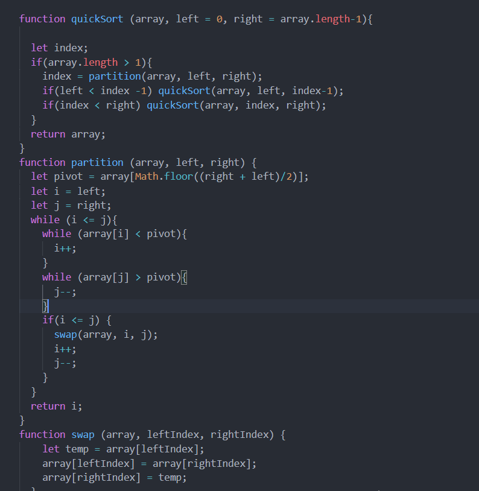

# Quick Sort:
Author : Aishah Satouf

## Challenge Summary
Create a function that takes an array of numbers as a single argument and return the array in a sorted way but useing a quick sort algorithm

## Challenge Description
Review the pseudocode below, then trace the algorithm by stepping through the process with the provided sample array. Document your explanation by creating a blog article that shows the step-by-step output after each iteration through some sort of visual.

Once you are done with your article, code a working, tested implementation of Quick Sort based on the pseudocode provided.

```
ALGORITHM QuickSort(arr, left, right)
    if left < right
        // Partition the array by setting the position of the pivot value 
        DEFINE position <-- Partition(arr, left, right)
        // Sort the left
        QuickSort(arr, left, position - 1)
        // Sort the right
        QuickSort(arr, position + 1, right)

ALGORITHM Partition(arr, left, right)
    // set a pivot value as a point of reference
    DEFINE pivot <-- arr[right]
    // create a variable to track the largest index of numbers lower than the defined pivot
    DEFINE low <-- left - 1
    for i <- left to right do
        if arr[i] <= pivot
            low++
            Swap(arr, i, low)

     // place the value of the pivot location in the middle.
     // all numbers smaller than the pivot are on the left, larger on the right. 
     Swap(arr, right, low + 1)
    // return the pivot index point
     return low + 1

ALGORITHM Swap(arr, i, low)
    DEFINE temp;
    temp <-- arr[i]
    arr[i] <-- arr[low]
    arr[low] <-- temp

```
      

## Approach & Efficiency
Approach:

This algorithm splits the original array in to equal or near equal parts and creates a pointer at either end of the array. The left pointer is compared to the pivot (middle value) if it is less than the pivot it stays where it is and the pointer moves one to the right. If the left pointer points to a value greater than the pivot, the right pointer value is compared to the pivot. If the right pointer value is greater than the pivot the right pointer moves one index to the left and compares again. If the left pointer indicates a value greater than the pivot and the right pointer indicates a value less than the pivot then the two values swap positions. This is repeated until the pointers meet in the middle. At this point the function recurses on the left half and right half of the partially sorted array. This continues until all values are in order.

Efficiency:
Time : O(nlogn)
Space : O(1)

## Solution

