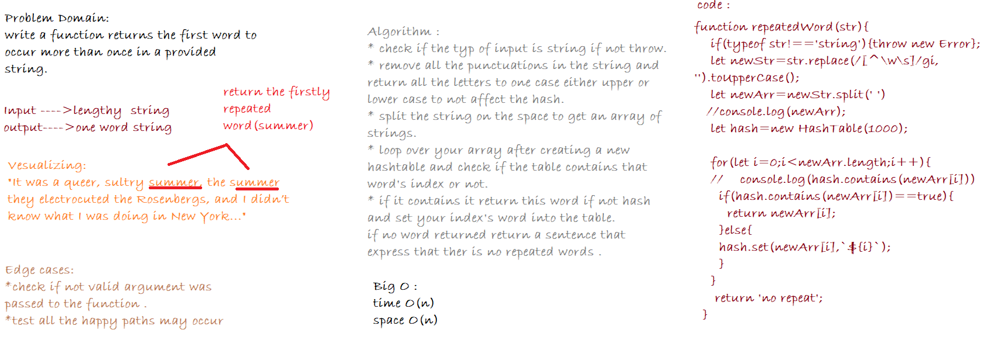

# Firstly Repeated Word

## Overview

Find the first repeated word in a book.by creating a function that takesa a lengthly string and return the firstly repeated word.

## Challenge

* Write a function that accepts a lengthy string parameter.
* Without utilizing any of the built-in library methods available to your language, return the first word to occur more than once in that provided string.

## Approach and Efficiency

Time: O(n)
Space: O(n) 

**test**
Run `npm test repeated-word.test.js`

## Solution

