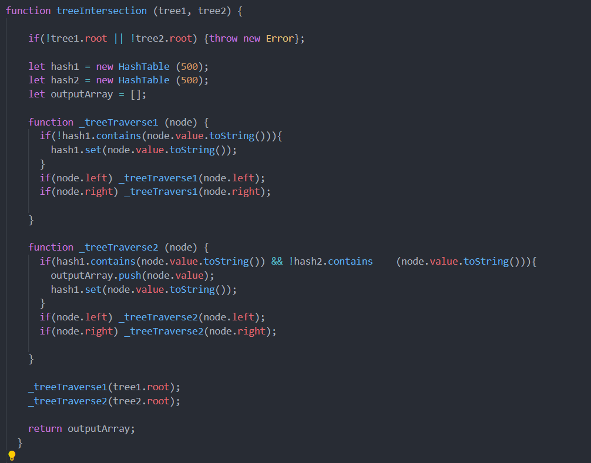

# Tree Intersection

## Overview

This is a function that takes two trees as parameters and returns the Intersectioned values of both in an array.

## Challenge

* Write a function called tree_intersection that takes two binary tree parameters.
* Without utilizing any of the built-in library methods available to your language, return a set of values found in both trees.

## Approach and Efficiency

Time: O(n)
Space: O(n) 

**test**
Run `npm test tree-intersection.test.js`

## Solution

