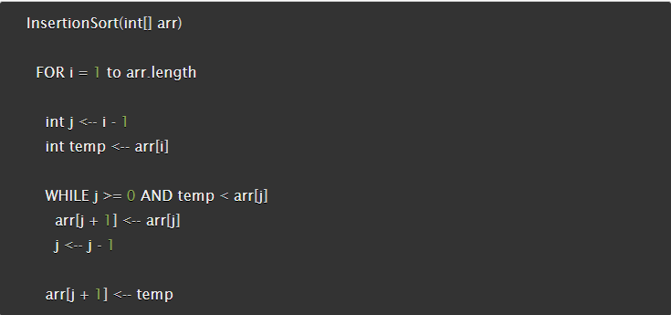
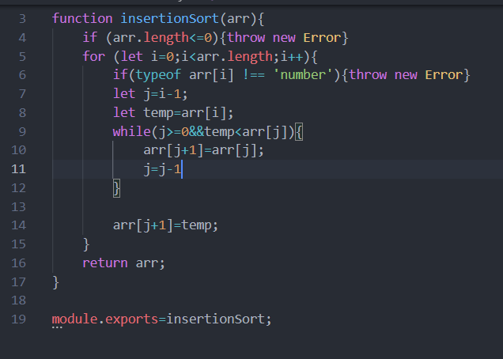

# Array Sort:
Author : Aishah Satouf

## Challenge Summary
Create a function that takes an array of numbers as a single argument and return the array in a sorted way 

## Challenge Description
Review the pseudocode below, then trace the algorithm by stepping through the process with the provided sample array. Document your explanation by creating a blog article that shows the step-by-step output after each iteration through some sort of visual.

Once you are done with your article, code a working, tested implementation of Insertion Sort based on the pseudocode provided.

## Approach & Efficiency
Approach:
looping over the array and comparing each value with it's  predecessor and replace the values from the lowest to hieghest one nd return the array.
Efficiency:
Time : O(n^2)
Space : O(1)

## Solution

